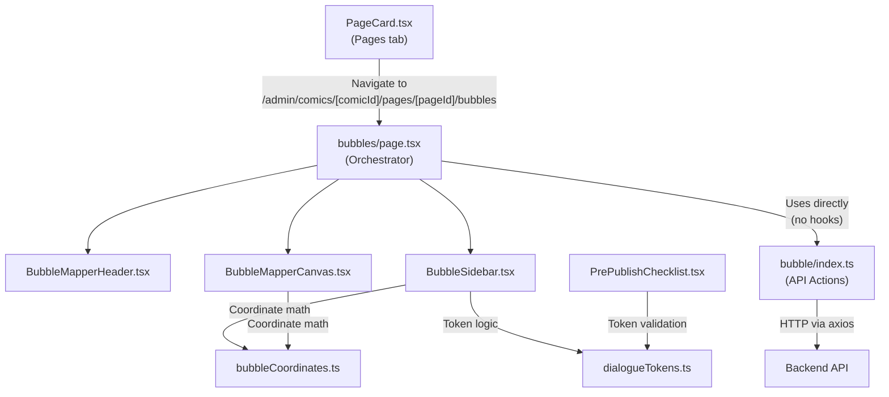
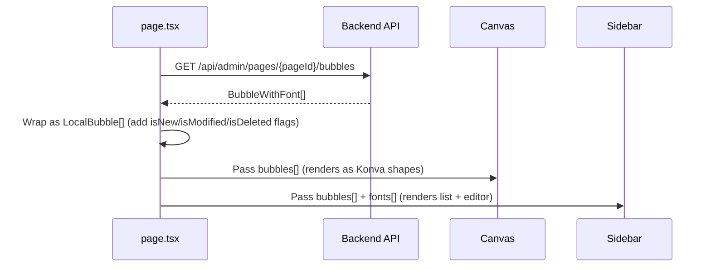
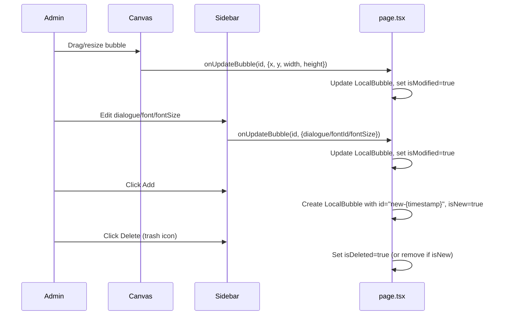
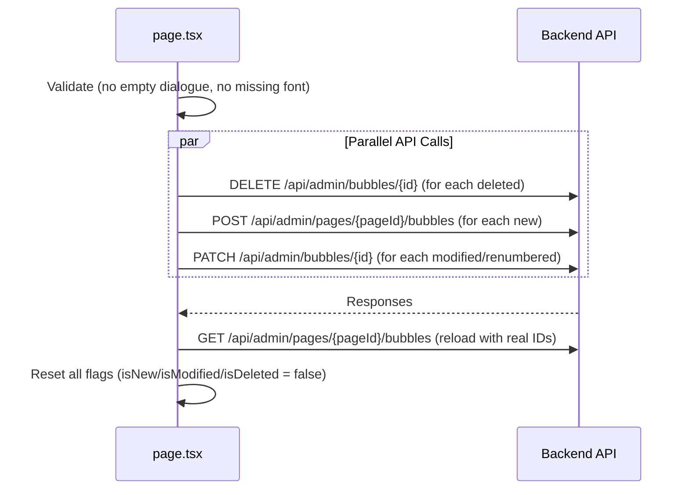

# Bubble Feature — Complete File-by-File Analysis

## Overview

The bubble system lets admins define **speech bubbles** on each comic page. Each bubble has a position (x, y, width, height), text dialogue (with substitution tokens for the reader's name/pronouns), a font, and a font size. At generation time, the backend stamps the personalised text onto the artwork.

---

## Architecture Diagram



---

## File-by-File Breakdown

---

### 1. Type Definitions

#### [comic.ts](file:///d:/Codes/Panthar/unilake-code/frontend/app/types/comic.ts#L134-L151)

Defines the shape of bubble data as it comes from and goes to the backend.

| Interface | Fields | Purpose |
|-----------|--------|---------|
| `Bubble` | `id`, `pageId`, `x`, `y`, `width`, `height`, `dialogue`, `fontId`, `fontSize`, `sortOrder`, `createdAt`, `updatedAt` | Core bubble model. All coordinates are **normalised 0–1 fractions** of the artwork dimensions. `fontSize` is a fraction of artwork height. |
| `BubbleWithFont` | extends `Bubble` + `font: { id, name } \| null` | Backend response includes the related font's name so the UI can display it without a separate lookup. |
| `PageWithBubbles` | extends `Page` + `bubbles: Bubble[]` | Each page in the comic detail response nests its bubbles. Used for pre-publish checks and page cards. |

> [!IMPORTANT]
> There is **no `rotation` field**. A detailed comment at [line 125–132](file:///d:/Codes/Panthar/unilake-code/frontend/app/types/comic.ts#L125-L132) explains why — the backend silently strips unknown fields, so sending rotation would appear to save but vanish on reload.

---

### 2. API Layer (Actions)

#### [bubble/index.ts](file:///d:/Codes/Panthar/unilake-code/frontend/app/actions/bubble/index.ts)

Four raw API functions. **No hooks are used for saves** — the page orchestrator calls these directly inside `handleSave`.

| Function | HTTP | Endpoint | Request Body | Response |
|----------|------|----------|-------------|----------|
| `fetchBubbles(pageId)` | `GET` | `/api/admin/pages/{pageId}/bubbles` | None | `BubbleWithFont[]` |
| `createBubble(pageId, payload)` | `POST` | `/api/admin/pages/{pageId}/bubbles` | `{ x, y, width, height, dialogue, fontId?, fontSize?, sortOrder? }` | `Bubble` |
| `updateBubble(bubbleId, payload)` | `PATCH` | `/api/admin/bubbles/{bubbleId}` | `Partial<Bubble>` (any subset of fields) | `BubbleWithFont` |
| `deleteBubble(bubbleId)` | `DELETE` | `/api/admin/bubbles/{bubbleId}` | None | void (204) |

> [!NOTE]
> All requests go through [axios.ts](file:///d:/Codes/Panthar/unilake-code/frontend/app/lib/axios.ts) which unwraps the `{ success, data, error }` envelope automatically. Base URL defaults to `http://localhost:8080`.

---

### 3. React Query Hooks

#### [useBubbles.ts](file:///d:/Codes/Panthar/unilake-code/frontend/hooks/useBubbles.ts)

| Hook | Purpose | Cache Key |
|------|---------|-----------|
| `useBubbles(pageId, comicId)` | Fetches bubbles for a page | `["comic", comicId, "page", pageId, "bubbles"]` |
| `useCreateBubble()` | Mutation wrapper | Invalidates bubble + page queries |
| `useUpdateBubble()` | Mutation wrapper | Invalidates bubble + page queries |
| `useDeleteBubble()` | Mutation wrapper | Invalidates bubble + page queries |

> [!WARNING]
> **These hooks exist but are NOT used by the bubble mapper page.** The orchestrator (`page.tsx`) calls the raw action functions directly and does `Promise.all` for batch saves. The hooks are only defined for potential future use or other consumers.

---

### 4. Shared Utilities

#### [bubbleCoordinates.ts](file:///d:/Codes/Panthar/unilake-code/frontend/components/admin/comic/bubbles/bubbleCoordinates.ts)

Handles all the math between the backend's normalised `0–1` coordinate system and the pixel coordinates Konva needs.

| Export | What It Does |
|--------|-------------|
| `normalizedToPixel(value, canvasSize, imgOriginalSize, imgRenderedSize)` | Converts a 0–1 fraction → pixel position on the rendered canvas |
| `pixelToNormalized(pixelValue, canvasSize, imgOriginalSize, imgRenderedSize)` | Converts a canvas pixel → 0–1 fraction for the API |
| `fontSizeToPx(fraction, surfaceHeight)` | Converts font size fraction → pixels. Used in both Canvas and Sidebar |
| `pxToFontSize(px, artworkHeight)` | Converts admin-typed pixel value → fraction (clamped to backend range) |
| `clampRect(rect)` | Ensures `0 ≤ x`, `0 ≤ y`, `x+width ≤ 1`, `y+height ≤ 1`. Mirrors backend validation |
| `DEFAULT_FONT_SIZE` | `0.02` — matches backend's `src/config/generation.ts` |
| `MIN_FONT_SIZE` / `MAX_FONT_SIZE` | `0.005` / `0.25` — backend rejects values outside this |
| `MIN_BUBBLE_SIZE` | `0.01` — smallest allowed bubble dimension |

---

#### [dialogueTokens.ts](file:///d:/Codes/Panthar/unilake-code/frontend/lib/dialogueTokens.ts)

Single source of truth for the four substitution tokens the backend replaces at generation time.

| Export | Value / Purpose |
|--------|----------------|
| `DIALOGUE_TOKENS` | `["{name}", "{pronoun_subject}", "{pronoun_object}", "{pronoun_possessive}"]` |
| `DIALOGUE_TOKEN_SET` | `Set` version for O(1) lookups |
| `DIALOGUE_TOKEN_LABELS` | Human-friendly labels: `Name`, `Subject`, `Object`, `Possessive` |
| `SAMPLE_NAMES` | `{ short: "Aarav", long: "Christopher" }` for preview |
| `SAMPLE_PRONOUNS` | `{ "{pronoun_subject}": "he", ... }` for preview |
| `findInvalidTokens(text)` | Regex `/\{[^}]*\}/g` — finds any `{...}` that isn't a valid token |
| `substituteTokens(text, name, pronouns)` | Replaces tokens with sample values for live preview |

---

### 5. UI Components

---

#### [page.tsx (Bubble Mapper Page)](file:///d:/Codes/Panthar/unilake-code/frontend/app/admin/(panel)/comics/[comicId]/pages/[pageId]/bubbles/page.tsx)

**The orchestrator.** This is the main page component that ties everything together.

**What it manages:**
- `bubbles: LocalBubble[]` — local working copy of all bubbles (with `isNew`, `isModified`, `isDeleted` flags)
- `selectedBubbleId` — which bubble the admin is editing
- `isSaving` — loading state during batch save

**How data loads:**
1. `useComic(comicId)` — fetches the full comic (includes pages with nested bubbles for page lookup)
2. `useFonts(comicId)` — fetches fonts for the dropdown
3. `fetchBubbles(pageId)` — called directly in `useEffect` to load `BubbleWithFont[]`, wrapped into `LocalBubble[]`

**How data saves (the critical `handleSave` function):**

```
handleSave() does:
  1. Validate: block if any active bubble has empty dialogue or no font
  2. Build a Promise[] array:
     - For each bubble with isDeleted && !isNew → deleteBubble(id)
     - For each active bubble with isNew → createBubble(pageId, {...})
     - For each active bubble with isModified OR stale sortOrder → updateBubble(id, {...})
  3. Promise.all(promises) — fires ALL creates/updates/deletes in parallel
  4. Invalidate queries + handleReset() to reload fresh data with real IDs
```

**Exact payload sent to `createBubble`:**
```json
{
  "dialogue": "string (the raw text with {name} tokens etc.)",
  "x": 0.1,       // normalised 0-1
  "y": 0.1,       // normalised 0-1
  "width": 0.3,   // normalised 0-1
  "height": 0.15, // normalised 0-1
  "fontSize": 0.02, // fraction of artwork height
  "fontId": "uuid-of-font",
  "sortOrder": 0   // position index in the list
}
```

**Exact payload sent to `updateBubble`:**
```json
{
  "dialogue": "string",
  "x": 0.1,
  "y": 0.1,
  "width": 0.3,
  "height": 0.15,
  "fontSize": 0.02,
  "fontId": "uuid-of-font",
  "sortOrder": 2
}
```
*(All fields are always sent on update, not just changed ones)*

---

#### [BubbleMapperHeader.tsx](file:///d:/Codes/Panthar/unilake-code/frontend/components/admin/comic/bubbles/BubbleMapperHeader.tsx)

**Pure display component.** Shows "Map Bubbles - Page X" title, Back button, Discard Changes button, and Save All button.

| Prop | Purpose |
|------|---------|
| `hasUnsavedChanges` | Enables/disables Save and Discard buttons |
| `hasBlockingIssue` | Disables Save when there are empty dialogues or missing fonts |
| `isSaving` | Shows spinner on Save button |

**Sends nothing to backend.** Just calls `onSave` and `onReset` callbacks.

---

#### [BubbleMapperCanvas.tsx](file:///d:/Codes/Panthar/unilake-code/frontend/components/admin/comic/bubbles/BubbleMapperCanvas.tsx)

**Konva-based visual editor.** Renders the artwork image with draggable/resizable bubble rectangles on top.

**What it does:**
1. Loads the artwork image via `useImage(artworkUrl)`
2. Calculates scale to fit the image in the available container
3. Renders each active bubble as a `<Group>` containing a `<Rect>` + `<Text>`
4. Handles drag-and-drop → converts pixel positions back to normalised → calls `onUpdateBubble`
5. Handles resize (via Konva `<Transformer>`) → converts new size to normalised → calls `onUpdateBubble`
6. Clamps all positions/sizes via `clampRect()` to stay within artwork bounds

**Sends nothing to backend directly.** All changes go through `onUpdateBubble(id, { x, y, width, height })` which updates the local state in `page.tsx`.

**Key coordinate flow:**
```
Admin drags bubble on canvas
  → Konva reports pixel position
  → pixelToNormalized() converts to 0-1
  → clampRect() ensures bounds
  → onUpdateBubble({ x, y }) updates LocalBubble
  → On Save, the normalised values go to the API
```

---

#### [BubbleSidebar.tsx](file:///d:/Codes/Panthar/unilake-code/frontend/components/admin/comic/bubbles/BubbleSidebar.tsx)

**The property editor panel.** Shows:

1. **Bubble list** (top, scrollable) — clickable cards showing dialogue preview, status badges (New, Modified, empty)
2. **Editor panel** (bottom, fixed) — appears when a bubble is selected

**Editor panel contains:**
- **Token toolbar** — 4 buttons (Name, Subject, Object, Possessive) that insert `{name}` etc. at cursor
- **Dialogue textarea** — raw text editor with ref for cursor-position insertion
- **Invalid token warning** — shows when `findInvalidTokens()` detects unknown `{...}` patterns
- **Live preview** — substitutes tokens with sample values, has Short/Long name toggle, shows char count
- **Font dropdown** — selects from `FontWithCount[]`, displays font name (resolved via lookup)
- **Font size** — input in **pixels** (using real artwork height), converted to fraction via `pxToFontSize()`
- **Coordinates display** — read-only x, y, width, height to 4 decimal places

**Sends nothing to backend directly.** All edits go through `onUpdateBubble` callback.

---

### 6. Pre-Publish Integration

#### [PrePublishChecklist.tsx](file:///d:/Codes/Panthar/unilake-code/frontend/components/admin/comic/review/PrePublishChecklist.tsx)

Two bubble-related checks in the publish review checklist:

| Check ID | Title | What It Checks | Blocking? |
|----------|-------|----------------|-----------|
| `bubble-fonts` | Bubble Fonts | `comic.pages.flatMap(p => p.bubbles).filter(b => !b.fontId)` — any bubble without a font | ❌ Advisory (amber) |
| `dialogue-tokens` | Dialogue Tokens | `findInvalidTokens(b.dialogue)` on every bubble — any unknown `{...}` pattern | ❌ Advisory (amber) |

These are **read-only checks** — they don't send anything to the backend. They use the nested `comic.pages[].bubbles[]` data that comes from the comic detail endpoint.

---

## Complete Data Flow Summary

### Loading (Backend → Frontend)



### Editing (Local State Only)



### Saving (Frontend → Backend)



---

## What Gets Sent to Backend — Field by Field

| Field | Type | Range | Where Set | Notes |
|-------|------|-------|-----------|-------|
| `dialogue` | `string` | Non-empty | Sidebar textarea | Raw text with `{name}`, `{pronoun_*}` tokens. Backend **does not validate** tokens. |
| `x` | `number` | `0 – (1 - width)` | Canvas drag or default `0.1` | Normalised fraction of artwork width |
| `y` | `number` | `0 – (1 - height)` | Canvas drag or default `0.1` | Normalised fraction of artwork height |
| `width` | `number` | `0.01 – 1` | Canvas resize or default `0.3` | Normalised fraction |
| `height` | `number` | `0.01 – 1` | Canvas resize or default `0.15` | Normalised fraction |
| `fontSize` | `number` | `0.005 – 0.25` | Sidebar input (admin types px, converted to fraction) | Fraction of artwork height. Default `0.02` |
| `fontId` | `string \| null` | UUID | Sidebar dropdown | First available font auto-assigned on create |
| `sortOrder` | `number` | `0, 1, 2, ...` | Computed from list position at save time | Determines render order. Re-computed every save |

> [!CAUTION]
> `fontSize` undergoes a double conversion: Admin types `69px` → `pxToFontSize(69, artworkHeight)` → stored as `0.0449` (fraction) → sent to API as `0.0449`. The backend multiplies it back by the artwork height when stamping text.

---

## File Map (Quick Reference)

| File | Role | Sends to Backend? |
|------|------|--------------------|
| [comic.ts](file:///d:/Codes/Panthar/unilake-code/frontend/app/types/comic.ts) | Type definitions | No |
| [bubble/index.ts](file:///d:/Codes/Panthar/unilake-code/frontend/app/actions/bubble/index.ts) | Raw API calls (fetch/create/update/delete) | **Yes** — the actual HTTP layer |
| [useBubbles.ts](file:///d:/Codes/Panthar/unilake-code/frontend/hooks/useBubbles.ts) | React Query wrappers | Not used by bubble mapper |
| [bubbleCoordinates.ts](file:///d:/Codes/Panthar/unilake-code/frontend/components/admin/comic/bubbles/bubbleCoordinates.ts) | Coordinate & font size math | No |
| [dialogueTokens.ts](file:///d:/Codes/Panthar/unilake-code/frontend/lib/dialogueTokens.ts) | Token constants, validation, preview | No |
| [page.tsx (orchestrator)](file:///d:/Codes/Panthar/unilake-code/frontend/app/admin/(panel)/comics/[comicId]/pages/[pageId]/bubbles/page.tsx) | State management, save logic, validation | **Yes** — calls action functions |
| [BubbleMapperHeader.tsx](file:///d:/Codes/Panthar/unilake-code/frontend/components/admin/comic/bubbles/BubbleMapperHeader.tsx) | Top bar with Save/Discard/Back | No |
| [BubbleMapperCanvas.tsx](file:///d:/Codes/Panthar/unilake-code/frontend/components/admin/comic/bubbles/BubbleMapperCanvas.tsx) | Konva visual editor | No |
| [BubbleSidebar.tsx](file:///d:/Codes/Panthar/unilake-code/frontend/components/admin/comic/bubbles/BubbleSidebar.tsx) | Property editor panel | No |
| [PrePublishChecklist.tsx](file:///d:/Codes/Panthar/unilake-code/frontend/components/admin/comic/review/PrePublishChecklist.tsx) | Publish review checks | No (read-only) |
| [PageCard.tsx](file:///d:/Codes/Panthar/unilake-code/frontend/components/admin/comic/pages/PageCard.tsx) | Shows bubble count, navigation link | No |
